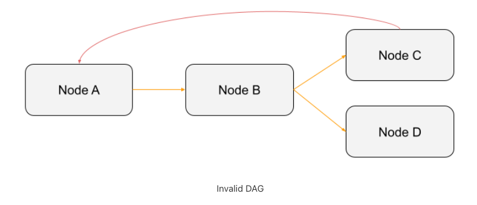
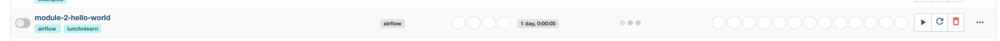
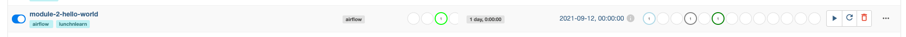
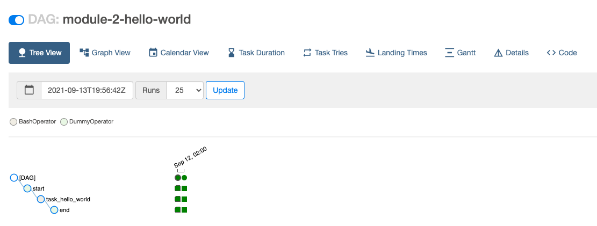
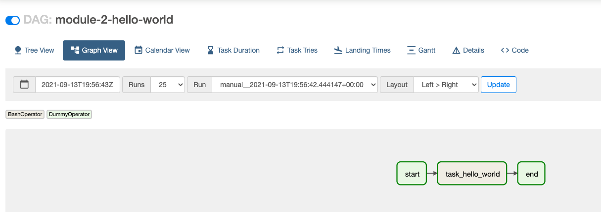
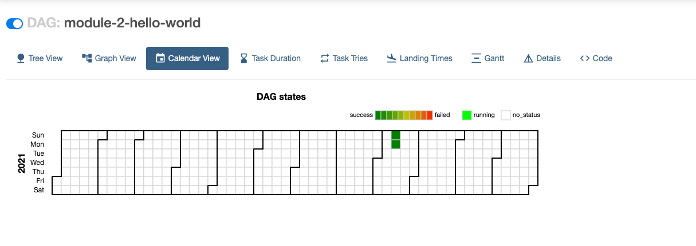
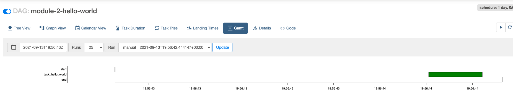
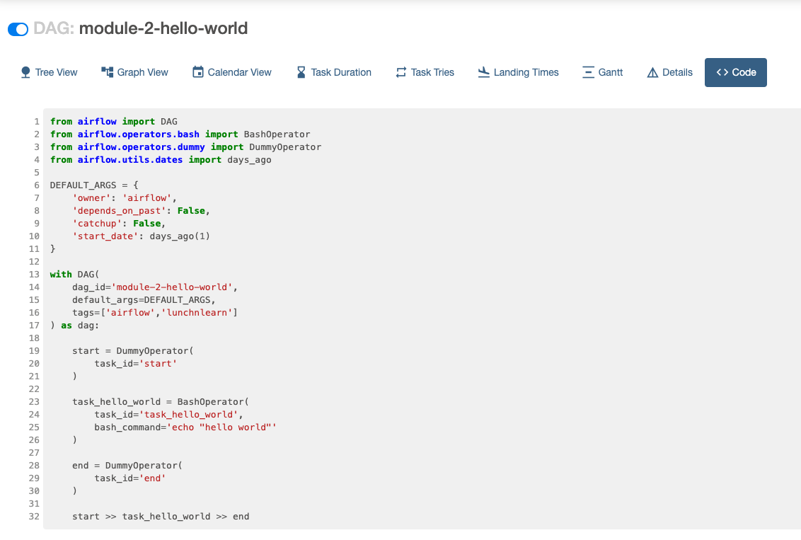

# Module 2 - Creating DAGs

## Instantiating a DAG object
A DAG is a Directed Acyclic Graph, meaning it's a graph with nodes, directed edges and no cycles.




To instantiate a DAG object
- DAG [class](https://airflow.apache.org/docs/apache-airflow/stable/_api/airflow/models/dag/index.html)

    ```
    with DAG('dag', default_args=default_args, schedule_interval=None, start_date=days_ago(1), tags=['example'])
    ```
- [TaskFlow](https://airflow.apache.org/docs/apache-airflow/stable/concepts/taskflow.html) API


    ```
    @dag(default_args=def   ault_args, schedule_interval=None, start_date=days_ago(1), tags=['example'])
    ```

## Tasks
These are the most basic units of execution in Airflow. They are arranged into a DAG while creating upstream and downstream dependencies.

1. Operators - predefined task templates that you can string together quickly to build most parts of your DAGs 
    ```
    ping = SimpleHttpOperator(endpoint="http://example.com/update/")
    ```
2. Sensors - a special subclass of Operators which are entirely about waiting for an external event to happen
3. A TaskFlow-decorated `@task`, which is a custom Python function packaged up as a Task.
    ```
    @task
    def hello_name(name: str):
        print(f'Hello {name}!')
    ```
## Triggering a DAG
After setting up the `start_date`, tasks, and their dependencies, the DAG can be triggered from the Airflow webserver UI.

- First, we need to enable the DAG

    

- If the DAG has a schedule interval and the current date has passed the first `execution_date` (`start_date` + `schedule_interval`), the DAG will run automatically after unpausing it.

    

- When `catchup=True`, Airflow will run **all** historical runs until the previous `execution_date`. 

## Airflow UI

1. [DAGs](http://localhost:8080/home) - this is where you can see all the DAGs you have access to both paused and unpaused ones. It's where you can see the total number of DAG runs (success, fail, running), the `schedule_interval`, and certain actions such as triggering the DAG, navigation, and documentation of the code.

2. Once you navigate throw a DAG, you'll see a couple of views and visuals.
    
    - [Tree View](http://localhost:8080/tree?dag_id=module-2-hello-world) - shows the historical DAG runs and the status of each task.

         
    
    - [Graph View](http://localhost:8080/graph?dag_id=module-2-hello-world) - shows you the DAG structure and the task dependencies. This also shows the status of the latest DAG run.

         

    - [Calendar View](http://localhost:8080/calendar?dag_id=module-2-hello-world) - shows you the heatmap of the DAG runs on the calendar.

        

    - [Gantt](http://localhost:8080/gantt?dag_id=module-2-hello-world) - this is the Gantt chart of the execution times of the tasks. This is useful in identifying bottlenecks in your DAGs so you can optimize it.

        

    - [Code](http://localhost:8080/code?dag_id=module-2-hello-world) - shows you the Python code that generated the DAG.

        

3. Access and Config - on the top right of the UI, you can navigate to different pages such as access, config, and Airflow documentation.

    

    - Security - any access and permission related configuration can be viewed and edited here
    - Admin - this is where you will setup variables and connections that Airflow will use for your DAGs. You can also see the different plugins, pools, and xcom (cross-communication) values here.
