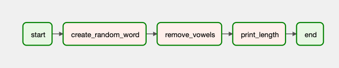
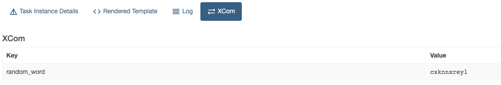
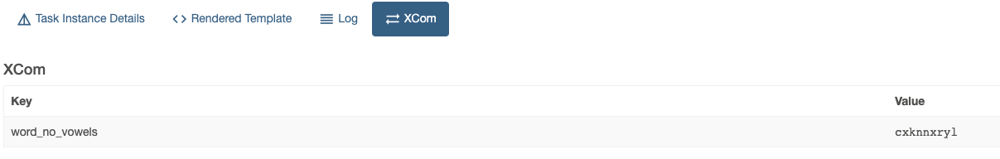
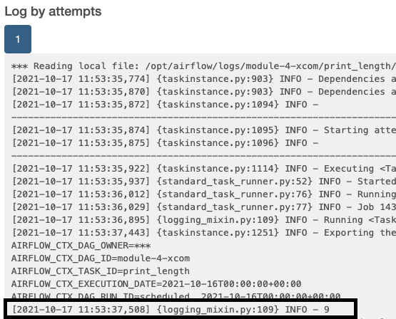

# Module 4 - XCOMs

## Cross-Communications (XCOMs)
- A mechanism that let **Tasks** talk to each other
- Identified by a `key`, `task_id`, and `dag_id` it came from
- Explicitly *pushed* and *pulled* using the **Task Instance** methods `xcom_pull` and `do_xcom_push`

## XCOM Example
This DAG contains five tasks, two of which are dummy operators to indicate the start and end of the DAG and three functions which do the following:



1. Generate a random n-letter word, in this case it will be 10 letters.
2. From that random word, the vowels will be removed.
3. Lastly, the length of the final word will be printed.

## XCOM Push
By default, the method `do_xcom_push` is enabled. The resuling XCOM will have a key called `return_value`. We can do a custom key by manually calling the `xcom_push` method. In our example, we will be using `random_word` as the key.

```
ti.xcom_push(key='random_word', value=random_word)
```



## XCOM Pull
To pull the XCOM from the previous task, we will be calling the `xcom_pull`s method. Since the task we'll be pulling the XCOM from is in the same DAG, we'll only be needing the `key` and `task_id`. The vowels are then removed from the pulled word.

```
word = ti.xcom_pull(key='random_word', task_ids='create_random_word')
```



Repeating the same process of pushing and pulling XCOMs, we arrive with the final result of printing out the length of the random word without the vowels.



## XCOM Backend
By default, XCOMs are stored in the metadata database. There are different limits for each kind of database.

- MySQL: 64 Kb
- Postgres: 1 Gb
- SQLite: 2 Gb

This means that it's not ideal to pass large datasets between tasks. With [Custom XCom Backends](https://www.astronomer.io/guides/custom-xcom-backends), you can push and pull XComs to and from external systems such as S3, GCS, or HDFS rather than the default metadata database, however this doesn't mean you should process this data in Airflow as it's more of an orchestrator than a data processing framework.
