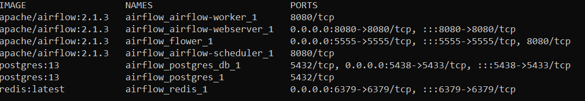
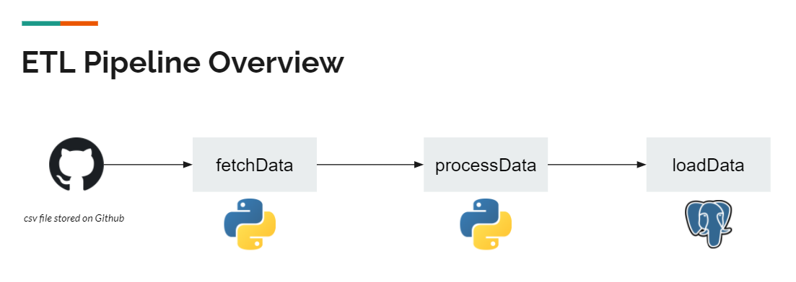
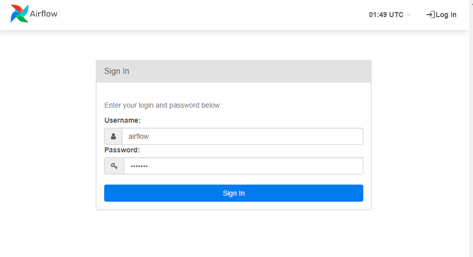
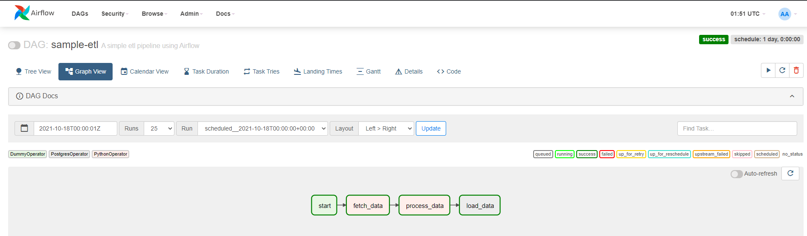
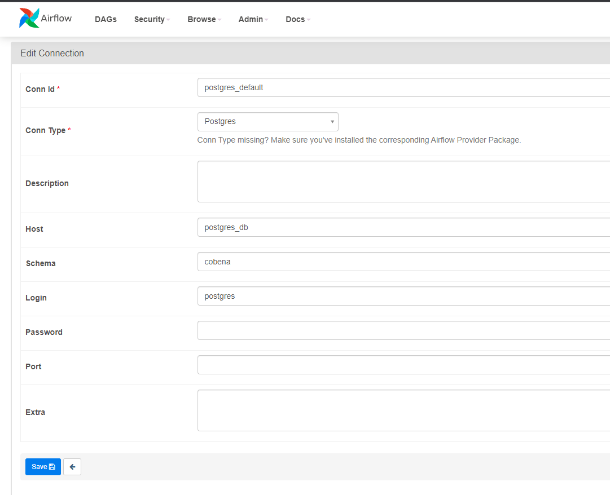
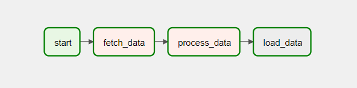

# Module 3 - Creating a sample ETL

## Setting up Airflow for local environment

We'll setup Airflow using the `docker-compose.yaml` file from Airflow.
https://airflow.apache.org/docs/apache-airflow/stable/start/docker.html#initializing-environment

1. Run the following command to setup a user
    ```
    docker-compose up airflow-init
    ```
2. After the user has been created, we can now launch the other Airflow components
    ```
    docker-compose up -d
    ```
3. You should be seeing healthy containers running when doing `docker ps -a`. To prettify the output of `docker ps -a`, you can run 
    ```
    docker ps --format "table {{.Image}}\t{{.Names}}\t{{.Ports}}"
    ```
    

    Notice that there's a new Postgres container running, this will be used for our ETL pipeline.

<hr>

## ETL Pipeline Flow

We will be retrieving a csv file that is stored on Github using Python and store it inside our container's file system. Then, we will apply some transformations to it. Lastly, we will load the transformed dataset to Postgres. We will use Airflow to orchestrate the whole process.



<hr>

## Viewing the DAG from the web UI

1. Go to localhost:8080, input username and password *(as specified in the docker-compose file: **airflow** for both)*




2. From the landing page, you can click on the DAG named 'sample_etl' and go to Graph View



<hr>

## Pre-requisites before running the DAG

1. We need to create an Airflow connection first for our Postgres database. To do this, go to `Admin > Connections`. Then type the following *(password is still postgres as specified in the docker-compose)*. This connection will enable Airflow to connect to our Postgres container




2. Pre-create the tables in our Postgres container where we will insert the transformed data. (No action needed as we already pre-created the tables using docker entrypoint script)

<hr>

## Triggering the DAG

Now that everything's set, we can now unpause the DAG and trigger it manually.

After triggering the DAG, you should see all tasks in the DAG wrapped with green borders signifying that they ran successfully.



## Verifying if transformed .csv got loaded into Postgres

1. Run `docker exec -it airflow_postgres_db_1 psql -U postgres`. You will be redirected right away to Postgres shell

2. Type `\l` to see the list of databases. You should see **cobena** in the list

3. Type `\c cobena` to connect to **cobena** database

4. Type `select * from covid;`

To learn more about the arcitecture, here's the [documentation](https://airflow.apache.org/docs/apache-airflow/stable/concepts/overview.html).
