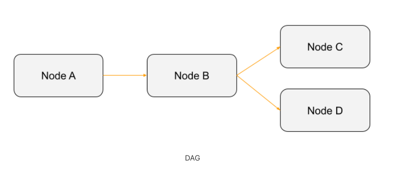

# Module 1 - Initialize Airflow

## Setting up Airflow for local environment

We'll setup Airflow using the `docker-compose.yaml` file from Airflow.
https://airflow.apache.org/docs/apache-airflow/stable/start/docker.html#initializing-environment

1. Run the following command to setup a user
    ```
    echo -e "AIRFLOW_UID=$(id -u)\nAIRFLOW_GID=0" > .env
    docker-compose up airflow-init
    ```
2. After the user has been created, we can now launch the other Airflow components
    ```
    docker-compose up -d
    ```
3. You should be seeing healthy containers running when doing `docker ps -a`
    

<hr>

## What is Airflow?

Airflow is a platform created by the community to programmatically **author**, **schedule** and **monitor** workflows. It was open-sourced by the data team of Airbnb.


(image from Airflow's website)

<hr>

## Airflow vs CRON


<hr>

## Airflow Core Concepts

- DAG
- Operators
- Task
- DagRun


### DAG


### Task
A Task is the basic unit of execution in Airflow. Tasks are arranged into DAGs, and then have upstream and downstream dependencies set between them into order to express the order they should run in.

### Operators
An operator represents a single, ideally idempotent, task. Operators determine what actually executes when your DAG runs.


### DagRun
A DAG Run is an object representing an instantiation of the DAG in time. Each DAG may or may not have a schedule, which informs how DAG Runs are created.

<hr>

To learn more about the architecture, here's the [documentation](https://airflow.apache.org/docs/apache-airflow/stable/concepts/overview.html).
To learn more about the arcitecture, here's the [documentation](https://airflow.apache.org/docs/apache-airflow/stable/concepts/overview.html).
